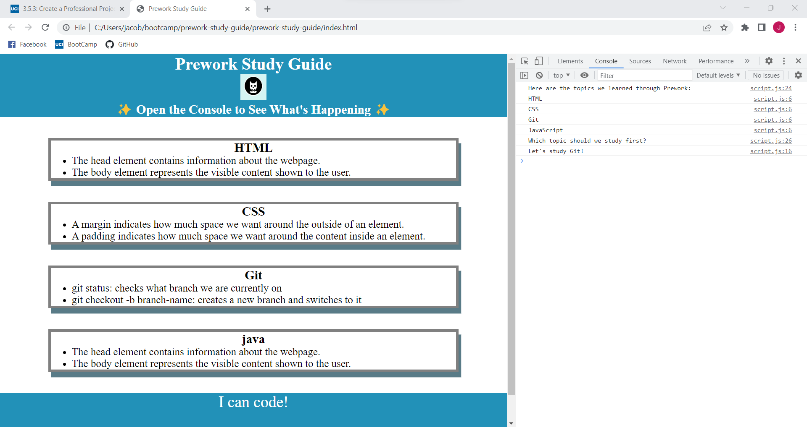

# Prework Study Guide Webpage

## This is a study guide designed to assist in learning web development. This page was built to teach me fundamentals and prepare me for my upcoming classwork. This can now be used as a study guide for reference in my future projects to remember key terms and commands that otherwise may cause delays in production of future projects. I have learned basics for CSS, Javescript, GIT, and HTML

## Installation

N/A

## Usage

This study guide can be used to referance material learned in the prework. To use launch the Chrome Devtools by pressing CONTROL+SHIFT+I. Using the opened panel navigate to the CONSOLE tab. This will provide suggestions on what topics to study.

## Credits
N/A

## License

Referece to LICENSEd